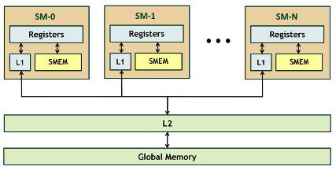

# 计算机体系结构基础 - 第 10 章作业

## 10.1
请介绍 MPI 中阻塞发送 `MPI_Send` / 阻塞接收 `MPI_Recv` 与非阻塞发送 `MPI_Isend` / 非阻塞接收 `MPI_Irecv` 的区别。

**解**

* 对于阻塞发送 `MPI_Send` / 阻塞接收 `MPI_Recv`，其在发送、接收时会将当前程序阻塞，直到发送、接收成功接口函数才会返回；
* 对于非阻塞发送 `MPI_Isend` / 非阻塞接收 `MPI_Irecv`，其在发送、接收时并不会阻塞当前程序，只要通信启动接口函数就会返回，程序需要调用其他的接口函数来查询非阻塞通信是否完成，例如 `MPI_Test`。

## 10.2
请介绍什么是归约（Reduce）操作，MPI 和 OpenMP 中分别采用何种函数或者子句来实现规约操作。

**解**

归约，指将一组数据通过某一个函数（操作）缩减到一个（或一小组）数据。常用的操作包含求和、求最大、求最小等。

* MPI 中通过 `MPI_Reduce` 函数来实现归约操作；
* OpenMP 中通过 `reduction` 子句来实现归约操作。

## 10.3
请介绍什么是栅障（Barrier）操作，MPI 和 OpenMP 中分别采用何种函数或者命令来实现栅障。

**解**

栅障（屏障）操作，是一种进程同步操作。屏障会阻塞到达屏障的进程，直到所有进程都到达屏障。

* MPI 中通过 `MPI_Barrier` 函数来实现栅障；
* OpenMP 中通过 `barrier` 编译制导语句来实现栅障。

## 10.4
下面的 MPI 程序片段是否正确？请说明理由。假定只有 2 个进程正在运行且 `mypid` 为每个进程的进程号。
```c
if (mypid == 0) {
    MPI_Bcast(buf0, count, type, 0, comm, ierr);
    MPI_Send(buf1, count, type, 1, comm, ierr);
} else {
    MPI_Recv(buf1, count, type, 0, comm, ierr);
    MPI_Bcast(buf0, count, type, 0, comm, ierr);
}
```

**解**

该 MPI 程序片段不正确，会造成死锁：
* 0 号进程的第 1 行进行了 `MPI_Bcast` 的集体通信操作，这会将它阻塞，直到所有的进程都完成了 `MPI_Bcast` 操作。那么，只有 1 号进程完成了它的第 2 行，0 号进程才能继续进行。
* 1 号进程的第 1 行进行了 `MPI_Recv` 的从 0 到 1 的点对点通信操作，这会将它阻塞，直到 0 号进程完成了 `MPI_Send` 操作。那么，只有 0 号进程完成了它的第 2 行，1 号进程才能继续进行。
* 现在，0、1 两个进程都被阻塞在了第 1 行，不可能执行第 2 行。这形成了死锁。

## 10.5
矩阵乘是数值计算中的重要运算。假设有一个 $m \times p$ 的矩阵 $\mathbf{A}$，还有一个 $p \times n$ 的矩阵 $\mathbf{B}$。令 $\mathbf{C}$ 为矩阵 $\mathbf{A}$ 和 $\mathbf{B}$ 的乘积，即 $\mathbf{C} = \mathbf{A}\mathbf{B}$。表示矩阵在 $(i, j)$ 位置处的值，则 $0 \leq i \leq m - 1$，$0 \leq j \leq n - 1$。请采用 OpenMP，将矩阵 $\mathbf{C}$ 的计算并行化。假设矩阵在存储器中按行存放。

**解**
下面的做法仅将最外层循环并行化：
```c
#include <stdio.h>
#include <string.h>
#include <omp.h>

#define MM  123
#define PP  231
#define NN  312

int matrix_A[MM][PP];
int matrix_B[PP][NN];
int matrix_C[MM][NN];

int main() {
    init_matrix_A();
    init_matrix_B();
    memset(matrix_C, 0, sizeof(matrix_C));

    matrix_mult();
}

void matrix_mult() {
#pragma omp parallel for
    for (int i = 0; i < MM; i++) {
        for (int j = 0; j < NN; j++) {
            for (int k = 0; k < PP; k++) {
                matrix_C[i][j] += matrix_A[i][k] * matrix_B[k][j];
            }
        }
    }
}
```
下面的做法将最外两层循环都并行化：
```c
#include <stdio.h>
#include <string.h>
#include <omp.h>

#define MM  123
#define PP  231
#define NN  312

int matrix_A[MM][PP];
int matrix_B[PP][NN];
int matrix_C[MM][NN];

int main() {
    init_matrix_A();
    init_matrix_B();
    memset(matrix_C, 0, sizeof(matrix_C));

    matrix_mult();
}

void matrix_mult() {
    #pragma omp parallel
    {
        #pragma omp single
        for (int i = 0; i < MM; i++) {
            for (int j = 0; j < NN; j++) {
                #pragma omp task
                for (int k = 0; k < PP; k++) {
                    matrix_C[i][j] += matrix_A[i][k] * matrix_B[k][j];
                }
            }
        }
    }
}
```

## 10.6
请采用 MPI 将上题中矩阵 $\mathbf{C}$ 的计算并行化，并比较 OpenMP 与 MPI 并行程序的特点。

**解**
```c
#include <stdio.h>
#include <mpi.h>

#define MM  123
#define PP  231
#define NN  312

int matrix_A[MM][PP];
int matrix_B[PP][NN];
int matrix_C[MM][NN];

int main(int argc, char ** argv) {
    int proc_id, num_proc, line;
    MPI_Status status;

    MPI_Init(&argc, &argv);
    MPI_Comm_rank(MPI_COMM_WORLD, &proc_id);
    MPI_Comm_size(MPI_COMM_WORLD, &num_proc);

    line = MM / num_proc;
    memset(matrix_C, 0, sizeof(matrix_C));
    int * A = (void *) matrix_A;
    int * B = (void *) matrix_B;
    int * C = (void *) matrix_C;

    if (proc_id == 0) {
        init_matrix_A();
        init_matrix_B();

        for (int i = 1; i < num_proc; i++) {
            MPI_Send(B, PP * NN, MPI_INT, i, 0, MPI_COMM_WORLD);
            MPI_Send(A + (i - 1) * line * PP, line * PP, MPI_INT, i, 1, 
                MPI_COMM_WORLD);
        }
        for (int i = 1; i < num_proc; i++) {
            MPI_Recv(C + (i - 1) * line * NN, line * NN, MPI_INT, i, 2, 
                MPI_COMM_WORLD, &status);
        }
        for (int i = (num_proc - 1) * line; i < MM; i++) {
            for (int j = 0; j < NN; j++) {
                for (int k = 0; k < PP; k++) {
                    matrix_C[i][j] += matrix_A[i][k] * matrix_B[k][j];
                }
            }
        }
    } else {
        MPI_Recv(B, PP * NN, MPI_INT, 0, 0, MPI_COMM_WORLD, &status);
        MPI_Recv(A + (proc_id - 1) * line * PP, line * PP, MPI_INT, 0, 1, 
            MPI_COMM_WORLD, &status);
        for (int i = (proc_id - 1) * line; i < proc_id * line; i++) {
            for (int j = 0; j < NN; j++) {
                for (int k = 0; k < PP; k++) {
                    matrix_C[i][j] += matrix_A[i][k] * matrix_B[k][j];
                }
            }
        }
        MPI_Send(C + (proc_id - 1) * line * NN, line * NN, MPI_INT, 0, 2, 
            MPI_COMM_WORLD);
    }
    MPI_Finalize();
    return 0;
}
```

比较 OpenMP 和 MPI 的程序我们可以发现：
* OpenMP 是建立在线程基础上的并行，不同线程之间可以方便的共享一部分内存；MPI 是建立在进程基础上的并行，不同进程之间的数据共享必须通过 MPI 接口函数来实现。
* OpenMP 的编译制导语句类似于宏，基于 OpenMP 的程序可以在完全忽略这些制导语句的情况下正常运行；MPI 的接口均为函数，基于 MPI 的程序只适用于并行运行。
* OpenMP 可以方便的利用制导语句将循环并行化，基本不需要程序员手动分配任务；MPI 相对要费劲很多，必须由程序员手动为每个进程分配任务。

## 10.7
分析一款 GPU 的存储层次。

**解**

下图是 NVIDIA Fermi 架构 GPU 的存储层次图。



* 每个 SM（流式多处理器，Streaming Multiprocessors）中，包含一个巨大的寄存器堆，大小为 128 KB。每个 SM 中又包含 32 个核心（Core）。
* 每个 SM 中，还包含 L1 缓存以及 SMEM（共享内存，Shared Memory）。它们的大小总共为 64 KB（48 KB Shared / 16 KB L1，或者 16 KB Shared / 48 KB L1）。
* 所有 SM 共用 L2 缓存，大小为 768 KB。
* CPU 和 GPU 同时可访问主存储体，大小最大为 6 GB。
