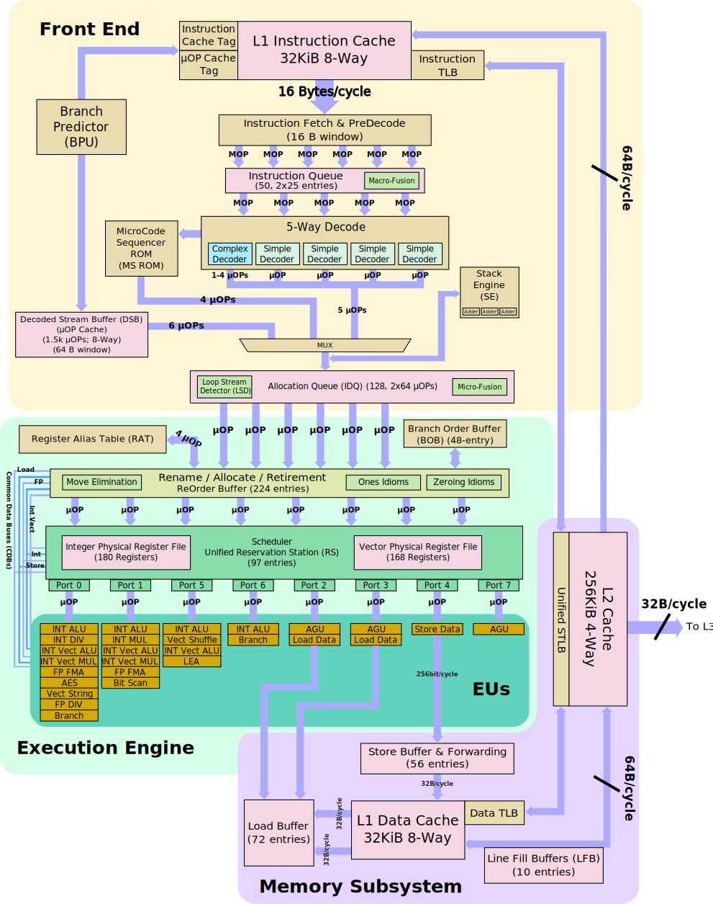
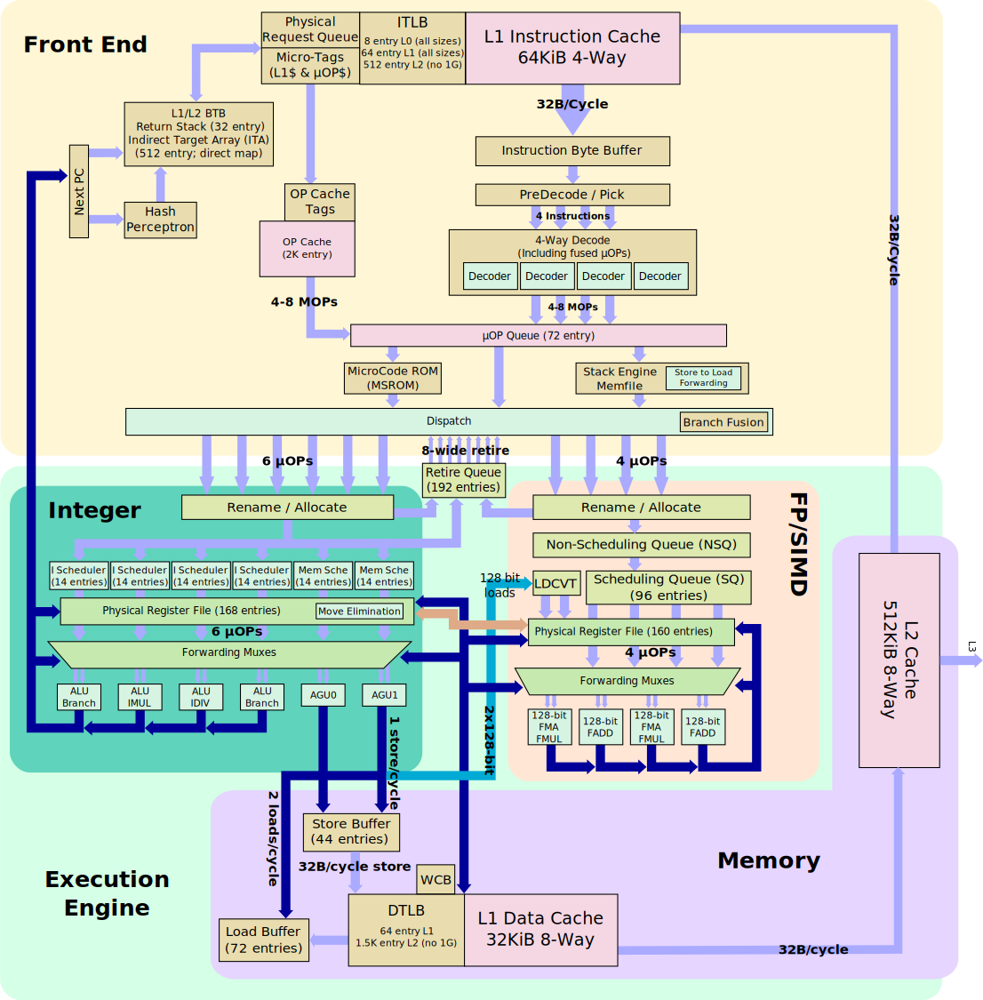

# 计算机体系结构基础 - 第 5 章作业

## 5.1
分别说明图 5.6 ~ 5.9 所示的四种结构中，每片包含冯诺依曼结构五个部分的哪部分功能。

**解**

图 5.6 CPU - GPU - 北桥 - 南桥四片结构：
* CPU 芯片包含了运算器、控制器的功能，同时包含了存储器中的高速缓存；
* GPU 芯片包含了与图形相关的运算器、控制器的功能，同时也是图形相关的输入输出设备；
* 北桥芯片包含了存储器的控制功能、输入输出设备的控制功能；
* 南桥芯片包含了存储器中的只读存储器、输入输出设备的控制功能，亦可视作包含了存储器中的永久存储器（硬盘）的控制功能。

图 5.7 CPU - 北桥 - 南桥三片结构：
* CPU 芯片包含了运算器、控制器的功能，同时包含了存储器中的高速缓存；
* 北桥芯片包含了与图形相关的运算器、控制器的功能，也是图像的输入输出设备，同时包含了存储器的控制功能、输入输出设备的控制功能；
* 南桥芯片包含了存储器中的只读存储器、输入输出设备的控制功能，亦可视作包含了存储器中的永久存储器（硬盘）的控制功能。

图 5.8 CPU - 弱北桥 - 南桥三片结构：
* CPU 芯片包含了运算器、控制器的功能，同时包含了存储器中的高速缓存和存储器的控制功能；
* 北桥芯片包含了与图形相关的运算器、控制器的功能，也是图像的输入输出设备，同时包含了输入输出设备的控制功能；
* 南桥芯片包含了存储器中的只读存储器、输入输出设备的控制功能，亦可视作包含了存储器中的永久存储器（硬盘）的控制功能。

图 5.9 CPU - 南桥两片结构：
* CPU 芯片包含了运算器、控制器的功能，同时包含了存储器中的高速缓存和存储器的控制功能，包含了与图形相关的运算器、控制器的功能和图像输入输出设备；
* 南桥芯片包含了存储器中的只读存储器、输入输出设备的控制功能，亦可视作包含了存储器中的永久存储器（硬盘）的控制功能。

## 5.2
查阅资料，比较 Skylake 处理器和 Zen 处理器的运算器结构。

<div style="page-break-after: always;"></div>

**解**
Skylake 处理器的单核架构如图：



Zen 处理器的单核架构如图：



<div style="page-break-after: always;"></div>

根据架构图可以看到，Skylake 和 Zen 单核均有 4 个 ALU。但是，Skylake 将浮点运算单元与整数运算单元做在了一起，Zen 则将浮点运算单元独立了出来；Skylake 的每个执行端口可执行的操作不同，Zen 每个执行端口则完全相同。

## 5.3
说明 ROB、保留站（发射队列）、重命名寄存器在指令流水线中的作用，并查阅资料，比较 Skylake 处理器和 Zen 处理器的 ROB、发射队列、重命名寄存器项数。

**解**

* ROB：即重排序缓冲（Re-Order Buffer)，在乱序执行技术中，用于使指令流水线中乱序执行完的指令有序地结束。其有序地将指令执行结果提交到目标寄存器或存储器，以保证执行结果符合程序规定的要求。
* 保留站（发射队列）：在乱序执行技术中，用于将有序的指令变为无序以提高执行效率。其保存操作数没有准备好的指令，待操作数准备好后再放入执行阶段。
* 重命名寄存器：再乱序执行技术中，用于临时存储指令和数据。其用于保存乱序执行过程中的指令执行结果，避免破坏结构寄存器的内容，使得两组执行不同运算但使用同一结构寄存器的指令并行执行。

Skylake 处理器和 Zen 处理器的 ROB、发射队列、重命名寄存器项数：
| 处理器  | ROB 项数 | 发射队列 | 重命名寄存器 |
| :-----: | :------: | :------: | :----------: |
| Skylake |  224 项  |  6 µOPs  |    180项     |
|   Zen   |  192 项  |  6 µOPs  |    168项     |

## 5.4
对于程序段
```
for (i = 0; i < 10; i++)
    for (j = 0; j < 10; j++)
        for (k = 0; k < 10; k++)
            {...}
```
计算分别使用一位 BHT 表和使用两位 BHT 表进行转移猜测时，三重循环的转移猜测准确率，假设 BHT 表的初始值均为 0。

**解**

使用一位 BHT 表时：
* 对循环 `k`，单次循环 `k` 将执行 $10$ 次跳转指令，进入、退出各会猜测错误 $1$ 次，猜测准确 $8$ 次，结束时 BHT 表对应项的值为 $0$。
* 对循环 `i`、`j`，同理，进入、退出各会猜测错误 $1$ 次，结束时 BHT 表对应项的值为 $0$。
* 那么，使用一位 BHT 表时，总的转移预测正确率为 $80\%$

使用两位 BHT 表时：
* 对循环 `k`：
  * 单次循环 `k` 将执行 $10$ 次跳转指令；
  * 第一次执行循环 `k` 时，前两次跳转均会猜错，随后一直正确，最后一次跳转又会猜错，总计猜测准确 $7$ 次，结束时 BHT 表对应项的值为 $2$；
    ```
    Correct       X X O O O O O O O X
    BHT after   0 1 2 3 3 3 3 3 3 3 2
    ```
  * 后续执行循环 `k` 时，前九次跳转均会猜对，最后一次跳转猜错，总计猜测准确 $9$ 次，结束时 BHT 表对应项的值为 $2$；
    ```
    Correct?      O O O O O O O O O X
    BHT after   2 3 3 3 3 3 3 3 3 3 2
    ```
  * 循环 `k` 总计执行 $100$ 次，跳转指令执行 $100 \times 10 = 1000$ 次，总计猜测准确 $7 + 9 \times 99 = 898$ 次。
* 对循环 `j`：
  * 单次循环、第一次执行、后续执行的讨论与循环 `k` 同理；
  * 循环 `j` 总计执行 $10$ 次，跳转指令执行 $10 \times 10 = 100$ 次，总计猜测准确 $7 + 9 \times 9 = 88$ 次。
* 对循环 `i`：
  * 其执行过程与循环 `k` 第一次执行相同；
  * 循环 `i` 只执行 $1$ 次， 跳转指令执行 $10$ 次，总计猜测准确 $7$ 次。
* 那么，使用两位 BHT 表时，总的转移预测正确率为 $(898 + 88 + 7) / (1000 + 100 + 10) \approx 89.46\%$

## 5.5
假设 A 处理器有两级 Cache，一级 Cache 大小为 32 KB，命中率为 95%，命中延迟为 1 拍，二级 Cache 大小为 1 MB，命中率为 80%，命中延迟为 30 拍，失效延迟为 150 拍。B 处理器有三级 Cache，一级 Cache 大小为 32 KB，命中率为 95%，命中延迟为 1 拍；二级 Cache 大小为 256 KB，命中率为 75%，命中延迟为 20 拍；三级 Cache 大小为 4 MB，命中率为 80%，命中延迟为 50 拍，失效延迟为 150 拍。比较两款处理器的平均访问延迟。

**解**

A 处理器的平均访问延迟为：
$$
95\% \times 1 + (1 - 95\%)\times [80\% \times 30 + (1- 80\%) \times 150] = 3.65 \ \text{拍}
$$

B 处理器的平均访问延迟为：
$$
95\% \times 1 + (1 - 95\%) \times \{ 75\% \times 20 + (1 - 75\%) \times [80\% \times 50 + (1 - 80\%) \times 150] \} = 2.575 \ \text{拍}
$$

可以看出，B 处理器的平均访问延迟比 A 处理器更短。

## 5.6
假设某内存访问，行关闭、打开、读写各需要两拍，在行缓存命中为 $70\%$ 和 $30\%$ 的情况下，采用 Open Page 模式还是 Close Page 模式性能更高？

**解**

在 Open Page 模式下：
* 行缓冲命中时，只需要读写操作，总共需要 $2$ 拍；
* 行缓冲不命中时，需要行关闭、行打开、读写操作，总共需要 $2 + 2 + 2 = 6$ 拍；
* 在行缓存命中为 $70\%$ 的情况下，平均需要 $3.2$ 拍；
* 在行缓存命中为 $30\%$ 的情况下，平均需要 $4.8$拍。

在 Close Page 模式下：
* 总是需要读写、行关闭操作，总共需要 $2 + 2 = 4$ 拍。

综上，在行缓存命中为 $70\%$ 的情况下，选择 Open Page 模式；在行缓存命中为 $30\%$ 的情况下，选择 Close Page 模式。

## 5.7
简要说明处理器和 IO 设备之间的两种通信方式的通信过程。

**解**

两种通信方式指的应该是两种寻址方式：内存映射 IO、特殊 IO 指令。
* 内存映射 IO：IO 寄存器被统一编址到内存地址空间中，处理器通过普通的访存指令访问对应的地址空间，经过地址转换后访问 IO 寄存器；
* 特殊 IO 指令：IO 地址空间与内存地址空间相互独立，处理器通过专用的 IO 指令来访问 IO 寄存器。

## 5.8
简要说明处理器和 IO 设备之间的两种同步方式的同步过程。

**解**

两种同步方式为：查询、中断。
* 查询：处理器在向 IO 设备发出请求后，不断地轮询 IO 设备的状态寄存器，直到设备完成请求后读回结果。
* 中断：处理器在向 IO 设备发出请求后，转去执行其他进程，设备完成请求后，产生一个中断信号，使处理器被中断后再去读取 IO 设备的状态寄存器。

## 5.9
在一个两片系统中，CPU 含内存控制器，桥片含 GPU、DC 和显存，简要说明在 PPT 翻页过程中，CPU、GPU、DC、显存、内存之间的同步和通信过程。

**解**

* 敲击键盘，键盘发送一个信号到桥片，桥片中的中断控制器记录这个信号并向处理器发出中断信号。
* 处理器收到中断信号，进入中断处理程序，从桥片中断控制器中获取中断信息，发现是键盘空格键被按下，于是找到 PowerPoint进程。
* PowerPoint 进程在内存中准备好 PPT 下一页的相关数据，调用显示驱动程序，启动 DMA 将要显示的内容通过桥片送到显存中。
* DC 读取显存中的相关信息，将内容显示在屏幕上。

## 5.10
调查目前市场主流光盘、硬盘、SSD 盘、内存的价格，并计算每 GB 存储容量的价格。

**解**

如下表：
<table>
    <thead>
        <tr>
            <th style="text-align:center">类型</th>
            <th style="text-align:center">型号</th>
            <th style="text-align:center">容量</th>
            <th style="text-align:center">价格</th>
            <th style="text-align:center">每 GB 价格</th>
            <th style="text-align:center">备注</th>
        </tr>
    </thead>
    <tbody>
        <tr>
            <th rowspan="3">光盘</th>
            <th>飞利浦 CD-R 光盘</th>
            <th>700 MB × 50</th>
            <th>￥55.00</th>
            <th>￥1.57</th>
            <th>CD 单次刻录光盘</th>
        </tr>
        <tr>
            <th>飞利浦 DVD-R 光盘</th>
            <th>4.7 GB × 50</th>
            <th>￥65.00</th>
            <th>￥0.27</th>
            <th>DVD 单次刻录光盘</th>
        </tr>
        <tr>
            <th>徕德 BD-R 光盘</th>
            <th>50 GB × 50</th>
            <th>￥350.00</th>
            <th>￥0.14</th>
            <th>BD 单次刻录光盘</th>
        </tr>
            <th rowspan="2">机械硬盘 HDD</th>
            <th>希捷 酷狼 ST4000VN008 </th>
            <th>4 TB</th>
            <th>￥725.00</th>
            <th>￥0.18</th>
            <th>NAS 服务器用机械硬盘</th>
        </tr>
        <tr>
            <th>希捷 酷鹰 ST4000VX007</th>
            <th>4 TB</th>
            <th>￥495.00</th>
            <th>￥0.12</th>
            <th>视频监控用机械硬盘</th>
        </tr>
        <tr>
            <th rowspan="2">固态硬盘 SSD</th>
            <th>三星 860 EVO</th>
            <th>500 GB</th>
            <th>￥429.00</th>
            <th>￥0.86</th>
            <th>2.5 寸 SATA 接口固态硬盘</th>
        </tr>
        <tr>
            <th>三星 970 EVO Plus</th>
            <th>500 GB</th>
            <th>￥550.00</th>
            <th>￥1.10</th>
            <th>NVME 接口固态硬盘</th>
        </tr>
        <tr>
            <th rowspan="2">内存</th>
            <th>金士顿 骇客 DDR4 3200 16GB</th>
            <th>16 GB</th>
            <th>￥569.00</th>
            <th>￥35.56</th>
            <th>台式机 DDR4 3200 内存</th>
        </tr>
        <tr>
            <th>三星 DDR4 2666 8GB</th>
            <th>8 GB</th>
            <th>￥209.00</th>
            <th>￥26.13</th>
            <th>笔记本 DDR3 2666 内存</th>
        </tr>
    </tbody>
</table>