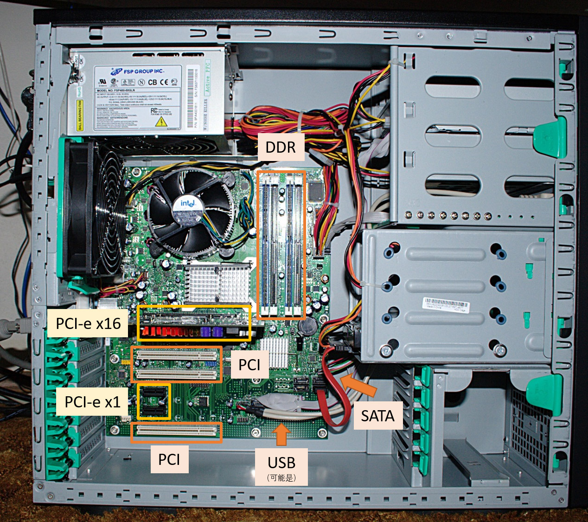

# 计算机体系结构基础 - 第 6 章作业

## 6.1
找一台电脑，打开机箱，说明每条连线都是什么总线。（注意：一定要先切断电源。）

**解**

如图所示。



图中没有标记的连线大多数是电源线。

## 6.2
说明总线包含哪些层次。

**解**

总线基本包含以下四个层次：
* 机械层：接口的机械外形、尺寸、信号排列顺序、连接线的长度范围等；
* 电器层：信号描述、电源电压、电平标准、信号质量等；
* 协议层：信号时序、握手规范、命令格式、错误处理等；
* 架构层：硬件模型、软件架构等。

## 6.3
计算一组 AXI 总线需要的信号线条数。

**解**

这里仅考虑课本上给出的主要信号。

设标识号位数为 $i$，地址位数为 $m$，数据位数为 $n$.

* 时钟与复位: $2$
* 写请求通道：$i + m + 3 + 4 + 2 + 1 + 1 = 11 + i + m$；
* 写数据通道：$i + n + \frac{1}{8}n + 1 + 1 = 2 + i + \frac{9}{8}n$；
* 写响应通道：$i + 2 + 1 + 1 = 4 + i$；
* 读请求通道：$i + m + 3 + 4 = 2 + 1 + 1 = 11 + i + m$；
* 读响应通道：$i + n + 2 + 1 + 1 = 4 + i + n$。

总计 $34 + 5i + 2m + \frac{17}{8}n$ 条信号。对于 4 位 ID、32 位地址线、32 位数据线的情况，总计需要 $186$ 条信号。

## 6.4
阅读 AMBA APB 总线协议并设计一个 APB 接口的 GPIO 模块。

**解**

Verilog 代码如下：
```verilog
module APB_GPIO # (
    parameter ADDR_WIDTH = 8,
    parameter DATA_WIDTH = 8,
    parameter GPIO_WIDTH = 8,
    parameter GPIO_DATA_ADDR = 8'h_f0,
    parameter GPIO_CONF_ADDR = 8'h_f1
) (
    input                    pclk,
    input                    presetn,
    input  [ADDR_WIDTH -1:0] paddr,
    input                    psel,
    input                    penable,
    input                    pwrite,
    output [DATA_WIDTH -1:0] prdata,
    input  [DATA_WIDTH -1:0] pwdata,

    input  [GPIO_WIDTH -1:0] gpio_in,
    output [GPIO_WIDTH -1:0] gpio_out,
    output [GPIO_WIDTH -1:0] gpio_out_en
);

    wire do_read;
    wire do_write;

    reg  [DATA_WIDTH -1:0] prdata_r;

    reg  [GPIO_WIDTH -1:0] gpio_config;
    reg  [GPIO_WIDTH -1:0] gpio_data;

    wire rw_data;
    wire rw_conf;

    assign gpio_out = gpio_data;
    assign gpio_out_en = gpio_config;

    assign do_read = psel && !penable && !pwrite;
    assign do_write = psel && penable && pwrite;

    assign prdata = prdata_r;
    always @ (posedge pclk) begin
        if (!presetn) begin
            prdata_r <= {DATA_WIDTH{1'b0}};
        end else if (do_read) begin
            if (paddr == GPIO_DATA_ADDR) begin
                prdata_r <= gpio_data;
            end else if (paddr == GPIO_CONF_ADDR) begin
                prdata_r <= gpio_config;
            end else begin
                prdata_r <= {DATA_WIDTH{1'b0}};
            end
        end
    end

    always @ (posedge pclk) begin
        if (!presetn) begin
            gpio_config <= {GPIO_WIDTH{1'b0}};
        end else if (do_write && paddr == GPIO_CONF_ADDR) begin
            gpio_config <= pwdata;
        end
    end

    always @ (posedge pclk) begin
        if (!presetn) begin
            gpio_data <= {GPIO_WIDTH{1'b0}};
        end else if (do_write && paddr == GPIO_DATA_ADDR) begin
            gpio_data <= (~gpio_config & gpio_in) | (gpio_config & pwdata);
        end else begin
            gpio_data <= (~gpio_config & gpio_in) | (gpio_config & gpio_data);
        end
    end
endmodule;
```

模块使用的 APB 总线地址、数据位宽均为 8 位，共有一组 8 位 GPIO。GPIO 配置寄存器地址为 `0xf1`，数据寄存器地址为 `0xf0`。配置寄存器对应位为高，代表 GPIO 对应引脚为输出，反之为输入。


## 6.5
DRAM 的寻址包含哪几部分？

**解**

DRAM 的寻址包含 Bank 地址、行地址、列地址三部分。在计算机系统中，若将多组 DRAM 串接在一起，则会增加片选信号。

## 6.6
假设一个处理器支持两个 DDR3 内存通道，每个通道为 64 位宽，内存地址线个数为 15，片选个数为 4，计算该处理器实际支持的最大内存容量。

**解**

每个通道为 64 位宽，则一次读写 8 字节数据。

根据题意：
* 该处理器支持 2 个内存通道；
* 每个内存通道有 4 条片选信号，即每个内存通道支持 2<sup>4</sup> = 16 组 DRAM。
* 题目中未提到每组 DRAM 的 Bank 数，这里默认 Bank 信号数量为 4，即支持 2<sup>4</sup> = 16 组 Bank。
* DDR3 中行列地址线复用，则支持的行、列数各 15。

综上，该处理器实际支持 2 × 2<sup>4</sup> × 2<sup>4</sup> × 2<sup>15</sup> × 2<sup>15</sup> × 8 Byte = 2<sup>42</sup> Byte = 4 TB 的内存容量。