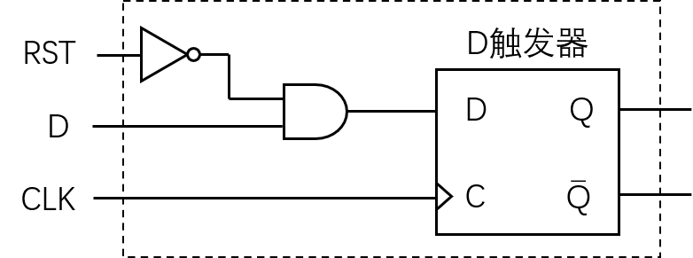

# 计算机体系结构基础 - 第 8 章作业

## 8.1
请将下列无符号数据在不同的进制表达间进行转换。

(1) 二进制转换为十进制：$101001_2$、$001101_2$、$01011010_2$、$0000111010000101_2$。  
(2) 十进制转换为二进制：$42_{10}$、$79_{10}$、$811_{10}$、$374_{10}$。  
(3) 十六进制转换为十进制：$\text{8AE}_{16}$、$\text{C18D}_{16}$、$\text{B379}_{16}$、$\text{100}_16$。  
(4) 十进制转换为十六进制：$81783_{10}$、$1922_{10}$、$345208_{10}$、$5756_{10}$。

**解**

(1) 二进制转换为十进制：

$101001_2 = 1 + 2^3 + 2^5 = 41_{10}$

$001101_2 = 1 + 2^2 + 2^3 = 13_{10}$

$01011010_2 = 2 + 2^3 + 2^4 +2^6 = 90_{10}$

$0000111010000101_2 = 1 + 2^2 + 2^7 + 2^9 + 2^{10} + 2^{11} = 3717_{10}$

(2) 十进制转换为二进制：

$42_{10} = 2 + 2^3 + 2^5 = 101010_2$

$79_{10} = 1 + 2 + 2^2 + 2^3 + 2^6 = 1001111_2$

$811_{10} = 1 + 2 + 2^3 + 2^5 + 2^8 + 2^9 = 1100101011_2$

$374_{10} = 2 + 2^2 + 2^4 + 2^5 + 2^6 + 2^8 = 101110110_2$

(3) 十六进制转换为十进制：

$\text{8AE}_{16} = 8 \times 16^2 + 10 \times 16 + 14 = 2222_{10}$

$\text{C18D}_{16} = 12 \times 16^3 + 1 \times 16^2 + 8 \times 16 + 13 = 49549_{10}$

$\text{B379}_{16} = 11 \times 16^3 + 3 \times 16^2 + 7 \times 16 + 9 = 45945_{10}$

$\text{100}_{16} = 1 \times 16^2 = 256_{10}$

(4) 十进制转换为十六进制：

$81783_{10} = 1 \times 16^4 + 3 \times 16^3 + 15 \times 16^2 + 7 \times 16 + 16 = \text{13F77}_{16}$

$1922_{10} = 7 \times 16^2 + 8 \times 16 + 2 = 782_{16}$

$345208_{10} = 5 \times 16^4 + 4 \times 16^3 + 4 \times 16^2 + 7 \times 16 + 8 = 54478_{16}$

$5756_{10} = 1 \times 16^3 + 6 \times 16^2 + 7 \times 16 + 12 = \text{167C}_{16}$

## 8.2
请给出 $32$ 位二进制数分别视作无符号数、原码、补码时所表示的数的范围。

**解**

无符号数：$0 \sim 2^{32} - 1$，即 $0 \sim 4294967295$；

原码：$-2^{31} + 1 \sim 2^{31} - 1$，即 $-2147483647 \sim 2147483647$；

补码：$-2^{31} \sim 2^{31} - 1$，即 $-2147483648 \sim 2147483647$；

## 8.3
请将下列十进制数表示为 $8$ 位原码和 $8$ 位补码，或者表明该数据会溢出：$45_{10}$、$-59_{10}$、$-128_{10}$、$119_{10}$、$127_{10}$、$128_{10}$、$0_{10}$、$-1_{10}$。

**解**

$8$ 位原码的表示范围是 $-2^7 + 1 \sim 2^7 -1$，即 $-127 \sim 127$；$8$ 位补码的表示范围是 $-2^7 \sim 2^7 -1$，即 $-128 \sim 127$。

|    十进制数 |      二进制数 |                      $8$ 位原码 |   $8$ 位补码 |
| ----------: | ------------: | ------------------------------: | -----------: |
|   $45_{10}$ |    $101101_2$ |                    $00101101_2$ | $00101101_2$ |
|  $-59_{10}$ |   $-111011_2$ |                    $10111011_2$ | $11000101_2$ |
| $-128_{10}$ | $-10000000_2$ |                            溢出 | $10000000_2$ |
|  $119_{10}$ |   $1110111_2$ |                    $01110111_2$ | $01110111_2$ |
|  $127_{10}$ |   $1111111_2$ |                    $01111111_2$ | $01111111_2$ |
|  $128_{10}$ |  $10000000_2$ |                            溢出 |         溢出 |
|    $0_{10}$ |         $0_2$ | $00000000_2$ 或 $11111111_2$ | $00000000_2$ |
|   $-1_{10}$ |        $-1_2$ |                    $10000001_2$ | $11111111_2$ |

## 8.4
请将下列数据分别视为原码和补码，从 $8$ 位扩展到 $16$ 位：$00101100_2$、$11010100_2$、$10000001_2$、$00010111_2$。

**解**

对原码，只需在符号位后添加 $8$ 个零；对补码，只需在符号位后添加 $8$ 个符号位。

|     数据     | 按原码扩展到 $16$ 位 | 按补码扩展到 $16$ 位 |
| :----------: | :------------------: | :------------------: |
| $00101100_2$ | $0000000000101100_2$ | $0000000000101100_2$ |
| $11010100_2$ | $1000000001010100_2$ | $1111111111010100_2$ |
| $10000001_2$ | $1000000000000001_2$ | $1111111110000001_2$ |
| $00010111_2$ | $0000000000010111_2$ | $0000000000010111_2$ |

## 8.5
请将下列浮点数在不同进制间进行转换。

(1) 十进制数转换为单精度数：$0$、$116.25$、$-4.375$。  
(2) 十进制数转换为双精度数：$-0$、$116.25$、$-2049.5$。  
(3) 单精度数转换为十进制数：$\text{0xff800000}$、$\text{0x7fe00000}$。  
(4) 双精度数转换为十进制数：$\text{0x8008000000000000}$、$\text{0x7065020000000000}$。

**解**

(1) 十进制数转换为单精度数：

* $0$：其单精度数表示为 $\text{0x00000000}$（零的阶码全 $0$、尾数全 $0$，正零的符号为 $0$）
  
* $116.25$：  
  $116.25_{10} = 1110100.01_2 = 1.11010001 \times 2^6$，  
  其符号为 $0$，阶码为 $6 + 127 = 133_{10} = 10000101_2$，尾数为 $11010001000000000000000$，  
  故其单精度数表示为 $\text{0x42E88000}$。

* $-4.375$：  
  $-4.375_{10} = -100.011_2 = -1.00011 \times 2^2$，  
  其符号为 $1$，阶码为 $2 + 127 = 129_{10} = 10000001_2$，尾数为 $00011000000000000000000$，  
  故其单精度数表示为 $\text{0xC08C0000}$。

(2) 十进制数转换为双精度数：

* $-0$：其双精度数表示为 $\text{0x8000000000000000}$（零的阶码全 $0$、尾数全 $0$，负零的符号为 $1$）
  
* $116.25$：  
  $116.25_{10} = 1110100.01_2 = 1.11010001 \times 2^6$，  
  其符号为 $0$，阶码为 $6 + 1023 = 1029_{10} = 10000000101_2$，尾数为 $1101000100000000000000000000000000000000000000000000$，  
  故其双精度数表示为 $\text{0x405D100000000000}$。

* $-2049.5$：  
  $-2049.5_{10} = -100000000001.1_2 = -1.000000000011 \times 2^{11}$，  
  其符号为 $1$，阶码为 $6 + 1023 = 1029_{10} = 10000000101_2$，尾数为 $0000000000110000000000000000000000000000000000000000$，  
  故其双精度数表示为 $\text{0xC050030000000000}$。

(3) 单精度数转换为十进制数：  
* $\text{0xff800000}$：二进制表示为 $11111111100000000000000000000000$  
  其符号为 $1$，阶码为 $11111111_2 = 255_{10}$，尾数为 $00000000000000000000000$，（阶码全 $1$、尾数全 $0$、符号为 $1$），  
  故其表示的是“负无穷”。

* $\text{0x7fe00000}$：二进制表示为 $01111111111000000000000000000000$  
  其符号为 $0$，阶码为 $11111111_2 = 255_{10}$，尾数为 $11000000000000000000000$，（阶码全 $1$，尾数非 $0$）  
  故其表示的是“非数”。

(4) 双精度数转换为十进制数：
* $\text{0x8008000000000000}$：二进制表示为 $1000000000001000000000000000000000000000000000000000000000000000$  
  其符号为 $1$，阶码为 $00000000000_2 = 0$，尾数为 $1000000000000000000000000000000000000000000000000000$，  
  故其表示的是 $-0.1_2 \times 2^{-216} = -0.5 \times 2^{-216}$，是一个非规格化非 $0$ 负数。

* $\text{0x7065020000000000}$：二进制表示为 $0111000001100101000000100000000000000000000000000000000000000000$  
  其符号为 $0$，阶码为 $11100000110_2 = 255_{10}$，尾数为 $0101000000100000000000000000000000000000000000000000$，
  故其表示的是 $1.01010000001_2 \times 2^{775}$。

## 8.6
请写出下图（图略）所示晶体管级电路图的真值表，并给出对应的逻辑表达式。

**解**

真值表如下：
|  $A$  |  $B$  |  $C$  |  $Y$  |
| :---: | :---: | :---: | :---: |
|  $0$  |  $0$  |  $0$  |  $1$   |
|  $0$  |  $0$  |  $1$  |  $1$   |
|  $0$  |  $1$  |  $0$  |  $1$   |
|  $0$  |  $1$  |  $1$  |  $0$   |
|  $1$  |  $0$  |  $0$  |  $1$   |
|  $1$  |  $0$  |  $1$  |  $0$   |
|  $1$  |  $1$  |  $0$  |  $1$   |
|  $1$  |  $1$  |  $1$  |  $0$   |

逻辑表达式为 $Y = \neg((A \lor B) \land C)$。

## 8.7
请写出下图（图略）所示逻辑门电路图的真值表。

**解**

真值表如下：
|  $A$  |  $B$  |  $C$  |  $Y$  |
| :---: | :---: | :---: | :---: |
|  $0$  |  $0$  |  $0$  |  $1$   |
|  $0$  |  $0$  |  $1$  |  $1$   |
|  $0$  |  $1$  |  $0$  |  $1$   |
|  $0$  |  $1$  |  $1$  |  $0$   |
|  $1$  |  $0$  |  $0$  |  $1$   |
|  $1$  |  $0$  |  $1$  |  $0$   |
|  $1$  |  $1$  |  $0$  |  $1$   |
|  $1$  |  $1$  |  $1$  |  $0$   |

逻辑表达式为 $Y = \neg((A \lor B) \land C)$。

## 8.8
请用尽可能少的而输入 NAND 门搭建出一个具有二输入 XOR 功能的电路。

**解**

由于 
$$A \oplus B = (A \land \neg B) \lor (\neg A \land B) 
= (A \land (\neg A \lor \neg B)) \lor (B \land (\neg A \lor \neg B))$$

<!--= (A \land \neg B) \lor (A \land \neg A) \lor (B \land \neg A)\lor (B \land \neg B) \\-->

可得最终电路如图。

## 8.9
请用 D 触发器和常见组合逻辑门搭建出一个具有同步复位为 $0$ 功能的触发器的电路。

**解**

如图。

## 8.10
证明 $[X + Y]_\text{补} = [X]_\text{补} + [Y]_\text{补}$。

**解**

证明如下：

根据补码的定义，有：
$$
[X + Y]_\text{补} = 2^n + (X + Y) \pmod{2^n}\\
[X]_\text{补} = 2 ^ n + X \pmod{2^n}\\
[Y]_\text{补} = 2 ^ n + Y \pmod{2^n}\\
$$

在模 $2^n$ 意义下，可向等号右边加 $2^n$，则有：
$$
[X + Y]_\text{补} = (2 ^ n + X) + (2 ^ n + Y) = [X]_\text{补} + [Y]_\text{补}
$$

得证。

## 8.11
证明 $[X - Y]_\text{补} = [X]_\text{补} + [-Y]_\text{补}$。

**解**

证明如下：

根据补码的定义，有：
$$
[X - Y]_\text{补} = 2^n + (X - Y) \pmod{2^n}\\
[X]_\text{补} = 2 ^ n + X \pmod{2^n}\\
[-Y]_\text{补} = 2 ^ n + (-Y) \pmod{2^n}\\
$$

在模 $2^n$ 意义下，可向等号右边加 $2^n$，则有：
$$
[X - Y]_\text{补} = (2 ^ n + X) + (2 ^ n + (-Y)) = [X]_\text{补} + [-Y]_\text{补}
$$

得证。

## 8.12
假设每个“非门”、“与非门”、“或非门”的扇入不超过 $4$ 个且每个门的延迟为 $T$，请给出下列不同实现的 $32$ 位加法器的延迟。

(1) 行波进位加法器；  
(2) $4$ 位一块且块内并行、块间串行的加法器；  
(3) $4$ 位一块且块内并行、块间并行的加法器。

**解**

(1) 行波进位加法器：

* 从最低位的输入 $A_0$、$B_0$、$C_\text{in}$ 到最高位的进位输出 $C_\text{out}$ 的延迟为 $2 \times T \times 32 = 64T$；
* 从最低位的输入 $A_0$、$B_0$、$C_\text{in}$ 到最高位的进位输入 $C_\text{31,in}$ 的延迟为 $2 \times T \times (32 - 1) = 62T$；
* 从最高位的输入 $A_{31}$、$B_{31}$、$C_\text{31,in}$ 到最高位的加和输出 $S_{31}$ 的延迟为 $3T$；
* 故从最低位的输入 $A_0$、$B_0$、$C_\text{in}$ 到最高位的加和输出 $S_{31}$ 的延迟为 $62T + 3T = 65T$。

(2) $4$ 位一块且块内并行、块间串行的加法器：
* 在逻辑门扇入不超过 $4$ 个的情况下，块内并行的 $4$ 位先行进位逻辑的 $c_4$ 延迟为 $4T$（需要将五输入与非门改造为与非门、或非门、非门的串联），$c_{1-3}$ 延迟为 $2T$。
* 从最低进位 $c_0$ 到最高位进位输出 $c_{16}$ 的延迟为 $8 \times 4T = 32T$；
* 从最低进位 $c_0$ 到最高位进位输入 $c_{15}$ 的延迟为 $7 \times 4T + 2T = 30T$；
* 从最高位进位输入 $c_{15}$ 到最高位加和结果 $s_{31}$ 的延迟为 $3T$；
* 故最低进位 $c_\text{in}$ 到最高位的加和输出 $s_{31}$ 的延迟为 $33T$。
* 生成 $p_i$、$g_i$ 的延迟为 $2T$
* 加法器的总延迟为 $35T$。

(3) $4$ 位一块且块内并行、块间并行的加法器。
* 从 $p_i$、$g_i$ 生成下层各块的 $P$、$G$ 需要 $2T$，中层从 $p_i$、$g_i$ 生成中层各块的 $P$、$G$ 需要 $2T$，上层生成 $c_{1-3}$ 需要 $2T$，中层生成 $c_{1-3}$ 需要 $2T$，下层生成 $c_{1-3}$ 需要 $2T$；
* 进位生成总共需要 $10T$ 时间
* 进位生成前生成 $p$、$g$ 需要 $2T$；
* 进位生成后全加器需要 $3T$；
* 加法器的总延迟为 $15T$。

## 8.13
作为设计者，在什么情况下会使用行波进位加法器而非先行进位加法器？

**解**

行波进位加法器所需门的数量远小于先行进位加法器，但延时远大于先行进位加法器。

因而在逻辑资源有限、对延时要求较低的条件下，会采用行波进位加法器而非先行进位加法器。

## 8.14

请利用图 8.21 所示的 $4$ 位先行进位逻辑组件出块内并行且块间并行的 $64$ 位先行进位加法器的进位逻辑，并证明其正确性。

## 8.15

请举例说明 $[X \times Y]_\text{补} \neq [X]_\text{补} \times [Y]_\text{补}$。

**解**

考虑 $4$ 位补码相乘得到 $8$ 位补码，$X = -6$，$Y = -7$，则 $X \times Y = 42$。

那么 $[X]_\text{补} = 1010_2$，$[Y]_\text{补} = 1001_2$，$[X \times Y]_\text{补} = 00101010_2$。

但是 $[X]_\text{补} \times [Y]_\text{补} = 01011010_2 \pmod{2^4}$，故 $[X \times Y]_\text{补} \neq [X]_\text{补} \times [Y]_\text{补}$。

## 8.16

请证明 $[X \times 2^n]_\text{补} = [X]_\text{补} \times 2^n$

**解**

考虑 $k$ 位补码的情况

根据补码定义 
$$
[X \times 2^n]_\text{补} = 2^k + X \times 2^n \pmod{2^k}\\
[X]_\text{补} \times 2^n = (2^k + X)\times 2^n = 2^n \times 2^k + X \times 2^n = 2^k + X \times 2^n \pmod{2^k}
$$
故
$$
[X \times 2^n]_\text{补} = [X]_\text{补} \times 2^n
$$

## 8.17
假设每个“非门”、“与非门”、“或非门”的扇入不超过 $4$ 个且每个门的延迟为 $T$，请给出下列不同实现将 $4$ 个 $16$ 位数相加的延迟。

(1) 使用多个先行进位加法器；  
(2) 使用华莱士树及先行进位加法器。

**解**

(1) 使用多个先行进位加法器：
* 搭建加法树，共需 $2$ 级先行进位加法器延迟，每级先行进位加法器延迟为 $11T$，故总延迟为 $22T$。

(2) 使用华莱士树及先行进位加法器：
* 华莱士树将 $4$ 个 $16$ 位数相加转换为 $2$ 个 $16$ 位数相加，其延迟为 $6T$；
* 两个数相加需要 $1$ 级先行进位加法器，其延迟为 $11T$
* 故总延迟为 $17T$

## 8.20
单精度和双精度浮点数能表示无理数 $\pi$ 吗？为什么？

**解**

单精度、双精度浮点数无法精确的表示无理数 $\pi$。

单精度、双精度浮点数本质上是有限小数，不能表示无限不循环小数 $\pi$。但在实际应用中，可以用单精度、双精度浮点数表示 $\pi$ 的近似值。