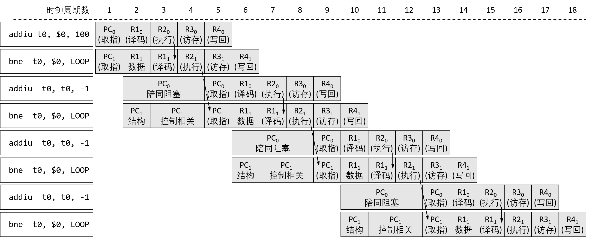
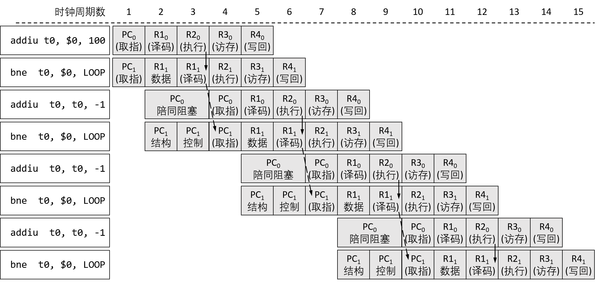

# 计算机体系结构基础 - 第 9 章作业

## 9.1
请给出下列程序在多周期处理器（如图 9.4 所示）上执行所需要的时钟周期数，并给出前三次循环执行的时空图。
```
    addiu   t0, $0, 100
LOOP:
    bne     t0, $0, LOOP
    addiu   t0, t0, -1
```

**解**

程序后两行执行 $101$ 次（`t0` 从 $100$ 递减到 $0$），程序共需要执行 203 条指令，每条指令需要 5 个时钟周期，故共需要 $203 \times 5 = 1015$ 个时钟周期。

前三次循环执行的时空图如下：


## 9.2
请给出题 1 中的程序在单发射 5 级静态流水线处理器（如图 9.6 所示）上执行所需要的时钟周期数，并给出前三次循环执行的流水线时空图。

**解**

第一条指令执行需要 $5$ 个周期，程序后两行循环一次需要 $5$ 个周期，共循环 $101$ 次（`t0` 从 $100$ 递减到 $0$），故共需要 $5 + 101 \times 5 = 510$ 个时钟周期。

前三次循环执行的时空图如下：


## 9.3
请给出题 1 中的程序在包含前递机制的单发射 5 级静态流水线处理器（如图 9.13 所示）上执行所需要的时钟周期数，并给出前三次循环执行的流水线时空图。

**解**

(1) 若采用课本上给出的前递机制（即当前指令的译码级需要在下一拍才能拿到上一条指令的执行级的前递数据，可能需要阻塞）：

第一条指令执行需要 $5$ 个周期，程序后两行循环一次需要 $3$ 个周期，共循环 $101$ 次（`t0` 从 $100$ 递减到 $0$），故共需要 $5 + 101 \times 3 = 308$ 个时钟周期。

前三次循环执行的时空图如下：


(2) 若采用幻灯片课件上给出的前递机制，（即当前指令的译码级可以在当拍能拿到上一条指令的执行级的前递数据，不需要阻塞）：

第一条指令执行需要 $5$ 个周期，程序后两行第 $1$ 次循环需要 $2$ 个周期，此后的循环需要 $3$ 个周期，共循环 $101$ 次（`t0` 从 $100$ 递减到 $0$），故共需要 $5 + 2 + 100 \times 3 = 307$ 个时钟周期。

前三次循环执行的时空图如下：


（3）若引入译码时对转移指令的计算，利用分支延迟槽消除阻塞：

第一条指令执行需要 $5$ 个周期，程序后两行循环一次需要 $2$ 个周期，共循环 $101$ 次（`t0` 从 $100$ 递减到 $0$），故共需要 $5 + 101 \times 2 = 207$ 个时钟周期。

前三次循环执行的时空图如下：


## 9.4
请给出题 1 中的程序在包含前递机制的双发射 5 级静态流水线处理器（如图 9.16 所示）上执行所需要的时钟周期数，并给出前三次循环执行的流水线时空图。

**解**

(1) 若采用课本上给出的前递机制（即当前指令的译码级需要在下一拍才能拿到上一条指令的执行级的前递数据，可能需要阻塞）：

第一条指令执行需要 $5$ 个周期，程序后两行循环一次需要 $5$ 个周期，共循环 $101$ 次（`t0` 从 $100$ 递减到 $0$），故共需要 $5 + 101 \times 5 = 510$ 个时钟周期。

前三次循环执行的时空图如下：


(2) 若采用幻灯片课件上给出的前递机制，（即当前指令的译码级可以在当拍能拿到上一条指令的执行级的前递数据，不需要阻塞）：

第一条指令执行需要 $5$ 个周期，程序后两行循环一次需要 $4$ 个周期，共循环 $101$ 次（`t0` 从 $100$ 递减到 $0$），故共需要 $5 + 101 \times 4 = 409$ 个时钟周期。

前三次循环执行的时空图如下：



（3）若引入译码时对转移指令的计算，利用分支延迟槽消除阻塞：

第一条指令执行需要 $5$ 个周期，程序后两行循环一次需要 $3$ 个周期，共循环 $101$ 次（`t0` 从 $100$ 递减到 $0$），故共需要 $5 + 101 \times 3 = 308$ 个时钟周期。

前三次循环执行的时空图如下：



可以注意到，双发射处理器的理论运算速度并不如单发射快。双发射处理器为了简化流水线控制，要求“只有同一级流水线的两条指令都不被更早的指令阻塞时，才能让这两条指令一起执行”，这样引入的陪同阻塞，造成了执行效率的下降。

## 9.5
请问要如何改进本章所述单发射静态 5 级流水线处理器的流水线功能定义，才能仅利用 MIPS 的分支指令延迟槽技术就能消除因控制相关所引入的流水线阻塞？

**解**

本章所述的单发射静态 5 级流水线处理器对跳转指令的处理，是在执行级完成的。

如果希望仅利用 MIPS 的分支指令延迟槽技术就能消除因控制相关所引入的流水线阻塞，则需要将跳转指令的处理提前到译码级完成。具体来说，需要在译码级添加跳转地址计算、跳转条件判断的相关逻辑。这样的话，当跳转指令完成译码级进入执行级时，跳转地址计算已经完成。此时，分支延迟槽指令进入译码级，而跳转后的指令进入取值级，可以直接获得跳转地址而不用阻塞。

相关时空图可参见 9.3 题的图 3。

## 9.6
请在图 9.13 的基础上添加必要的逻辑，使其能够实现精确异常的功能。画出修改后的处理器结构图，并进行解释。

**解**

修改后的处理器结构图入下：


为每一级寄存器增加异常信息的存储部分。在写回级，增加修改状态寄存器、记录异常处理PC等的逻辑。为取指级增加选择异常处理程序入口地址的数据选择器。


## 9.7
图 9.13 中指令存储器和数据存储器的 SRAM 都采用了异步读形式，如果将指令存储器和数据存储器的 SRAM 调整为同步读形式，请问处理器的结构将如何调整？画出修改后的处理器结构图，并进行解释。

**解**

SRAM 调整为同步读后，需要在取指级、访存级前一级向存储器发出读地址信号。对取指级来说，需要在更新 PC 的同时发出读地址信号；对于访存级来说，需要在执行级计算出访存地址后发出读地址信号。修改主要围绕这两个要求添加相关逻辑。

修改后的处理器结构图入下：


## 9.8
请问数据相关分为哪几种？静态流水线处理器是如何解决这几种相关的？采用寄存器重命名的动态流水线是如何解决这几种相关的？

**解**

分为 3 种：写后读（RAW）、写后写（WAW）、读后写（WAR）。

静态流水线中，只会出现写后读（RAW），而不会出现写后写（WAW）、读后写（WAR）。写后读（RAW）最基本的处理方法是阻塞，即在之前的相关指令完成写入之前，将后续相关指令阻塞在译码级。还可以采用前递技术，将已经计算出但还未写会的结果传递给译码级。

动态流水线中，写后读（RAW）通过动态调度来解决，将存在写后读相关指令阻塞于保留站中；写后写（WAW）、读后写（WAR）则通过寄存器重命名技术实现，引入新的空闲寄存器来避免冲突。

## 9.9
假设在包含前递机制的单发射 5 级流水线处理器（如图 9.13 所示）的译码级添加了一个永远预测跳转的静态分支预测器，那么题 1 中的程序在这个处理器上执行需要花费多少时钟周期？

**解**
对于题 1 中的程序，前 100 次 bne 指令为跳转，最后一次 bne 指令为不跳转，分支预测器绝大多数时间是正确的。在这样的情况下，跳转后的指令 bne 不需要阻塞到上一条跳转指令的执行级后才开始取指，可以提前一拍。但是，由于 bne 与分支延迟槽中的 addiu 存在相关，又会在译码级阻塞一拍。这导致了每轮循环的时钟周期没有发生改变，仍花费 308 个时钟周期。

## 9.10
假设程序动态执行过程中 load、store 指令占 $40\%$。现在有两种数据 Cache 的设计方案，其中第一种的 Cache 容量小于第二种方案，因此采用第一种方案的 Cache 命中率为 $85\%$，第二种方案的 Cache 命中率为 $95\%$，但是采用第二种方案时处理器的主频会比第一种低 $10\%$。请问那种设计方案性能更优？（假设 Cache 不命中情况下会阻塞流水线 100 个时钟周期。）

**解**

考虑有 $N$ 条指令的程序，第一种方案的主频是 $f$：
* 根据题意，第二种方案的主频是 $(1 - 10\%) \times f = 0.9 f$：
* load、store 指令共 $40\% \times 10 = 0.4 N$ 条；
* 第一种方案所需的时钟周期数：$0.4 N \times (1-85\%) \times 100 + N = 7N$;
* 第二种方案所需的时钟周期数：$0.4 N \times (1-95\%) \times 100 + N = 3N$;
* 第一种方案所需时间：$7N / f = 7 N/f$；
* 第二种方案所需时间：$3N / 0.9f = 3.33 N/f$。

综上，第二种方案性能更优。